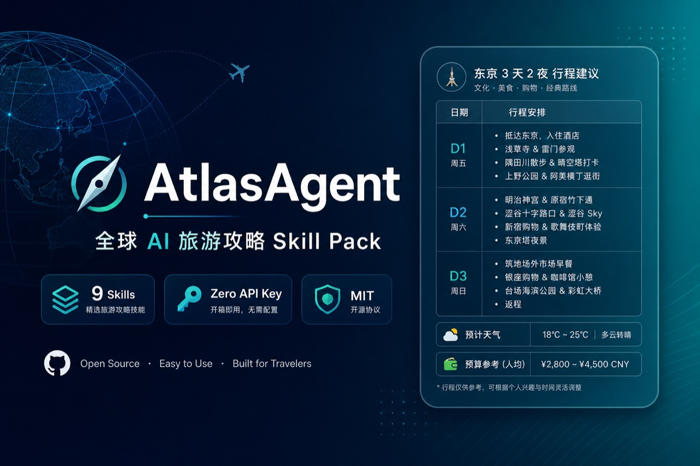
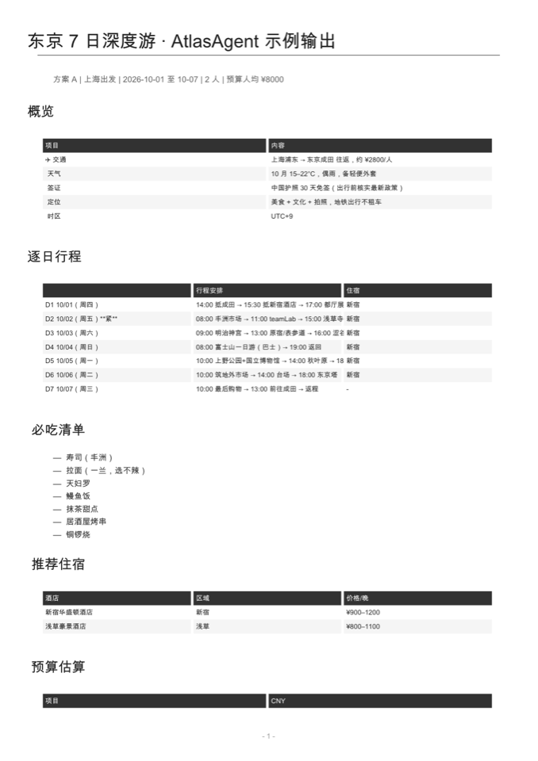

# AtlasAgent

**给你的 AI Agent 一键装上全球旅游规划能力**

[Agent Skills 开放标准](https://agentskills.io/specification) · 9 个专业 Skill · 零 API Key 起步 · 兼容 Cursor / Claude Code / Codex / Copilot / Hermes 等

[](LICENSE)
[](https://agentskills.io)

<p align="center">
  
</p>

[快速开始](#快速上手) · [English README](README.md) · [安装文档](docs/install.md) · [架构](docs/architecture.md)

---

## 为什么需要 AtlasAgent？

AI Agent 能写代码、改文档——但你让它规划一趟真正的旅行，它常常做不到位：

- 🗺️ 「帮我规划东京 7 天，含预算和每日行程」→ **缺结构**，只有泛泛建议
- 🌤️ 「那几天天气怎样，穿什么」→ **无可靠预报**，或工具超时
- 💱 「预算 8000 人民币够吗，当地多少钱」→ **不算汇率**，数字对不上
- 🛂 「中国护照要不要签证」→ **凭记忆乱说**，政策过时
- 🍜 「我不吃辣，每顿吃什么」→ **只给餐厅名**，没有具体菜品
- ✈️ 「要不要租车还是坐地铁」→ **缺决策框架**
- 📄 「导出一份能打印的 PDF」→ **没有现成流程**

**这些都能做，但要自己拼 prompt、找 API、写脚本。**

**AtlasAgent 把这件事变成一句话：**

```
帮我安装 AtlasAgent：https://raw.githubusercontent.com/wpfbcr/AtlasAgent/main/docs/install.md
```

复制给你的 Agent，几分钟后它就能按标准工作流生成多方案行程、预算表、签证提醒，并导出 PDF。

**已装过？更新也是一句话：**

```
帮我更新 AtlasAgent：https://raw.githubusercontent.com/wpfbcr/AtlasAgent/main/docs/update.md
```

> ⭐ **Star 这个项目**，我们会持续补充目的地知识库、对齐 Agent Skills 生态。平台变了我们改，有新城市模板我们加。

### 在你用之前

| | |
|---|---|
| 💰 **L0 完全免费** | Open-Meteo + Frankfurter + 知识库，无需 API Key |
| 🔒 **数据在本地** | 脚本本地运行；不收集行程数据 |
| 🤖 **兼容所有 Agent** | 任何能跑命令行、能读 SKILL.md 的 Agent 都能用 |
| 🩺 **自带诊断** | `atlas-agent doctor` 一条命令检查是否就绪 |
| 📦 **Agent 无关** | Hermes 只是可选安装目标，不是必需 |

---

## 能力一览

| 能力 | L0 零配置 | L1 增强（可选） |
|------|-----------|----------------|
| 🌤️ **天气预报** | Open-Meteo | — |
| 💱 **多币种预算** | Frankfurter/ECB | — |
| 📅 **日历/闭馆提示** | holiday_check.py | — |
| 🗺️ **目的地知识库** | 东京/巴黎/纽约 + PR 扩展 | web 搜索补充 |
| 🛂 **签证/入境** | 速查 + web 核实 | — |
| 🍜 **饮食定制** | 全球饮食标签 | — |
| 🚗 **交通决策** | 租车/地铁/铁路通票 | trvl MCP 实时价 |
| 💬 **口碑调研** | web 搜索 | Agent-Reach / Reddit |
| 📄 **PDF 导出** | md2pdf.py + fpdf2 | — |

> 不知道怎么配 L1？告诉 Agent「帮我配 trvl MCP」或「先用基础版」即可。

---

## 快速上手

复制这句话给你的 AI Agent：

```
帮我安装 AtlasAgent：https://raw.githubusercontent.com/wpfbcr/AtlasAgent/main/docs/install.md
```

就这一步。Agent 会 clone 仓库、安装 9 个 Skill、配置 `ATLAS_ROOT`、跑体检。

<details>
<summary><b>它会做什么？（点击展开）</b></summary>

1. **Clone 仓库** — `~/AtlasAgent/`（含 scripts + skills + 知识库）
2. **安装 9 个 Skill** — 写入 Cursor / Claude / Codex 等 skills 目录
3. **配置 ATLAS_ROOT** — shell 环境变量指向仓库根目录
4. **安装 fpdf2**（可选）— PDF 导出
5. **运行 doctor** — 确认天气/汇率 API 可用
6. **询问 L1 增强** — 航班 MCP、地图 CLI 等按需配置

</details>

> 🛡️ **安全模式**（不自动改 shell、不自动 pip）：
> ```
> 帮我安装 AtlasAgent（安全模式）：https://raw.githubusercontent.com/wpfbcr/AtlasAgent/main/docs/install.md
> 安装时使用 --safe 参数
> ```

### 手动安装

```bash
git clone https://github.com/wpfbcr/AtlasAgent.git ~/AtlasAgent
export ATLAS_ROOT=~/AtlasAgent
bash ~/AtlasAgent/scripts/atlas-agent install --env=auto
bash ~/AtlasAgent/scripts/atlas-agent doctor
```

---

## 装好就能用

告诉 Agent 即可，例如：

- 「帮我规划 2026 年 10 月东京 7 天，2 人，人均预算 8000 人民币，不吃辣」
- 「对比巴黎和罗马 5 天浪漫之旅，上海出发」
- 「我已订 10/1 航班，帮我排剩下行程」

**不需要记命令。** Agent 读取 `atlas-agent` SKILL.md 后按 5 阶段工作流执行。

<details>
<summary><b>CLI 速查（Agent 内部使用）</b></summary>

```bash
python3 "$ATLAS_ROOT/scripts/weather_client.py" forecast --city Tokyo --days 7
python3 "$ATLAS_ROOT/scripts/currency_client.py" convert 8000 --from CNY --to JPY
python3 "$ATLAS_ROOT/scripts/holiday_check.py" --from 2026-10-01 --days 7 --city Tokyo
python3 "$ATLAS_ROOT/scripts/md2pdf.py" examples/tokyo-7days-zh.md
```

</details>

---

## Demo

<p align="center">
  
</p>

| 示例 | 链接 |
|------|------|
| 东京 7 日 | [examples/tokyo-7days-zh.md](examples/tokyo-7days-zh.md) |
| 巴黎 5 日 | [examples/paris-romantic-5days-zh.md](examples/paris-romantic-5days-zh.md) |

---

## 9 个 Skill

| Skill | 作用 |
|-------|------|
| [atlas-agent](skills/atlas-agent/SKILL.md) | 主编排器 |
| [weather](skills/weather/SKILL.md) | 天气预报 |
| [currency](skills/currency/SKILL.md) | 汇率换算 |
| [visa-entry](skills/visa-entry/SKILL.md) | 签证入境 |
| [dietary-global](skills/dietary-global/SKILL.md) | 饮食限制 |
| [transport-global](skills/transport-global/SKILL.md) | 交通决策 |
| [local-intel](skills/local-intel/SKILL.md) | 口碑调研 |
| [travel-documents](skills/travel-documents/SKILL.md) | 证件清单 |
| [budget-optimizer](skills/budget-optimizer/SKILL.md) | 预算优化 |

---

## 设计理念

**AtlasAgent 是能力层（capability layer），不是又一个聊天模板。**

它负责 **选型、安装、体检、编排** —— 天气用 Open-Meteo、汇率用 Frankfurter、知识库可 PR 扩展。Agent 按 SKILL.md 直接调用脚本和 references，没有黑盒包装。

```
skills/atlas-agent/     → 主编排 + destinations 知识库
skills/weather/         → 预报子 skill
scripts/                → 可执行 CLI（doctor 会检查）
```

换 API = 换脚本或 reference，不重写整套 prompt。

---

## 命令参考

| 命令 | 作用 |
|------|------|
| `atlas-agent install --env=auto` | 安装 Skill + 配置环境 |
| `atlas-agent install --agent=cursor` | 仅安装到 Cursor |
| `atlas-agent install --safe` | 只输出手动步骤 |
| `atlas-agent install --dry-run` | 预览将执行的操作 |
| `atlas-agent doctor` | 健康检查 |
| `atlas-agent doctor --json` | JSON 格式输出 |
| `atlas-agent check-update` | 更新指引 |

---

## 贡献

欢迎 PR 添加 [目的地知识库](skills/atlas-agent/references/destinations/_template.md)！详见 [CONTRIBUTING.md](CONTRIBUTING.md)。

---

## ⭐ 为什么值得 Star

- 全球行程规划 Skill Pack，不是又一个国内游模板
- 遵循 Agent Skills 开放标准，**任意 Agent 即插即用**
- L0 零 API Key，clone 就能跑
- 目的地知识库社区共建

Star 一下，下次规划旅行时能快速找到。⭐

---

## Star History

[](https://star-history.com/#wpfbcr/AtlasAgent&Date)

---

## License

[MIT](LICENSE)

English: [README.md](README.md)
